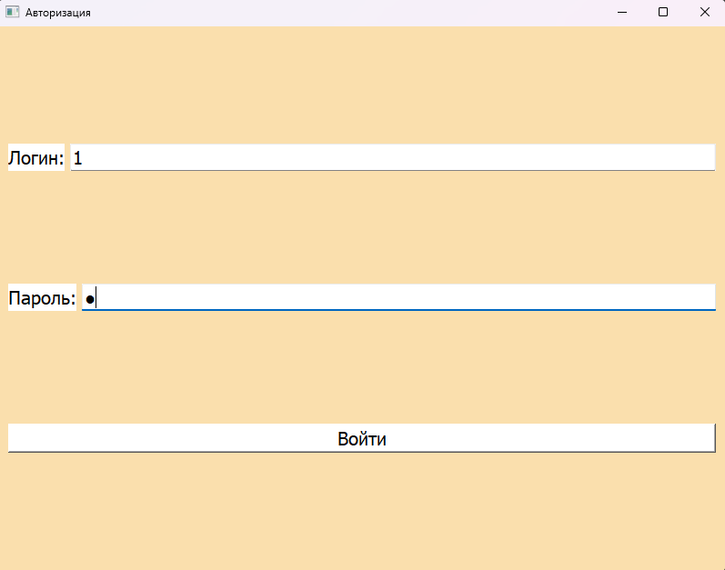
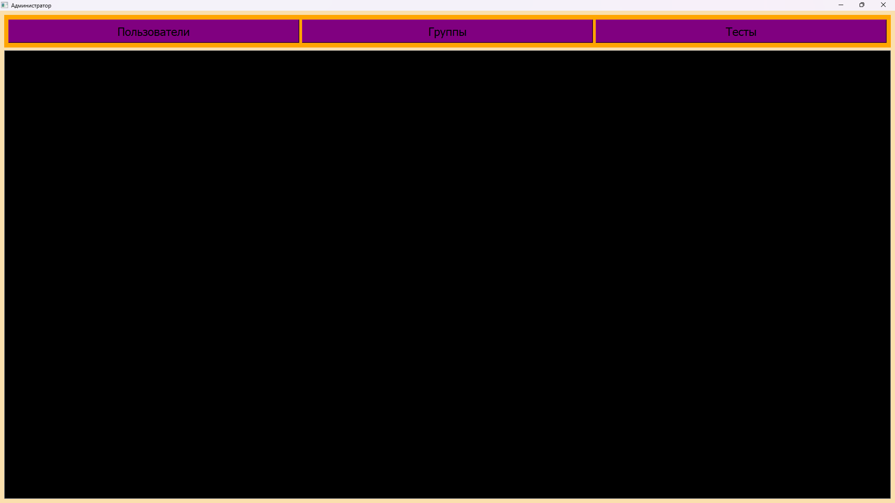
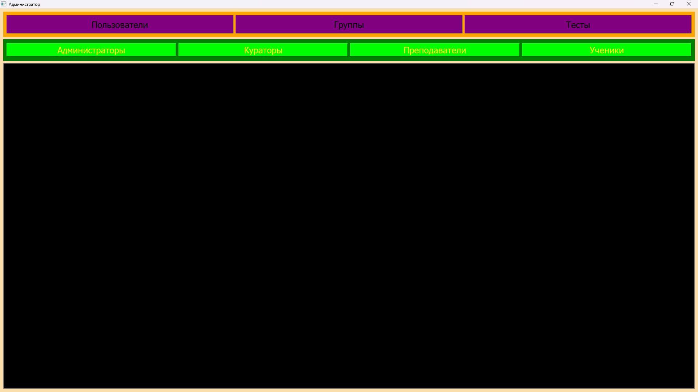
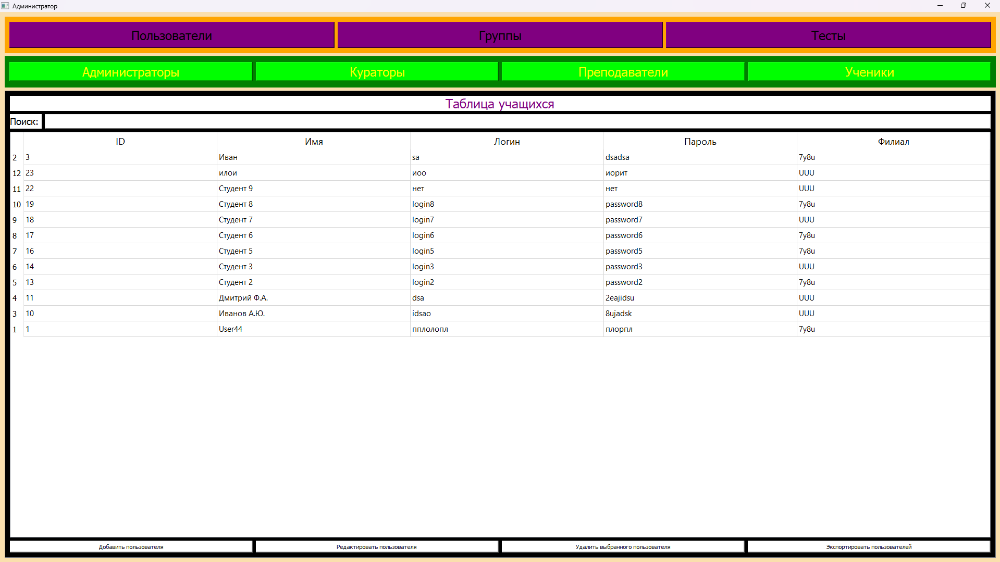
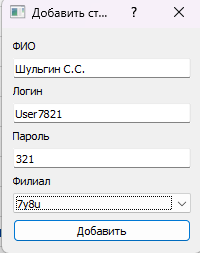
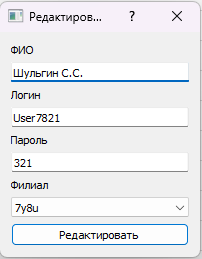
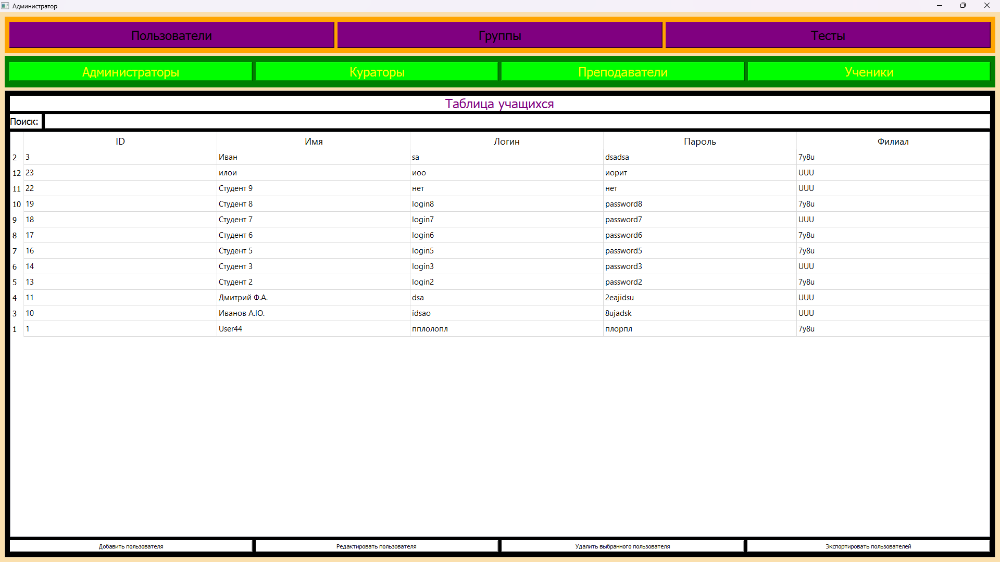
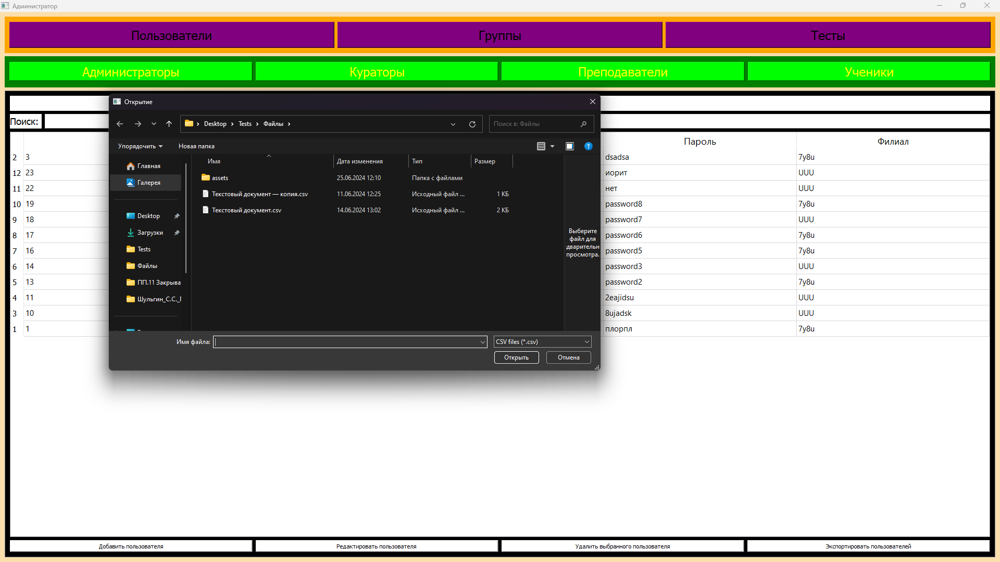
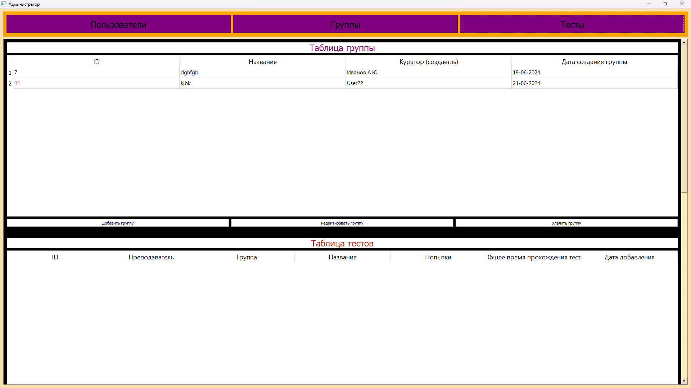
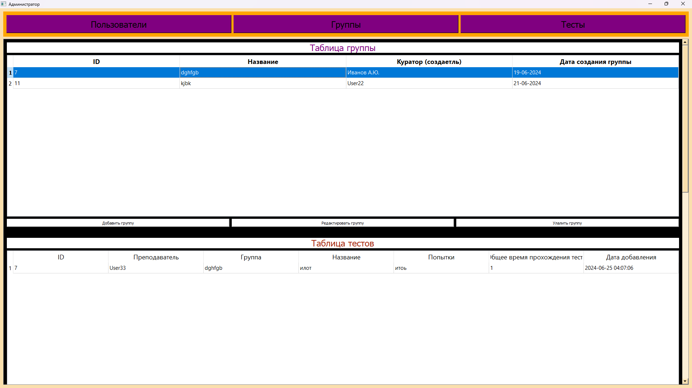

# Руководство администратора

Разрабатываемое приложение предназначено для администрирования баз данных, ведения справочников и проведения тестов.

## Системные требования

Для корректной работы программного продукта необходимо следующее аппаратное и программное обеспечение:

- Центральный процессор с тактовой частотой не менее 2.33 ГГц;
- Оперативная память объемом не менее 6 Гб;
- Дисковое пространство объемом не менее 3 Гб;
- Разрешение монитора не менее 1280x720 пикселей.

Программа поддерживает операционные системы Windows 7 и выше. Для функционирования информационной системы необходимо установить VS Code и Python версии 3.10.11 и выше. Информационная система разработана на языке программирования Python.

## Установка и модификация приложения

Для установки приложения необходимо выполнить следующие шаги:

1. Запустите установочный файл приложения.
2. Установите требуемые библиотеки, используемые в проекте. Для этого в папке проекта нажмите правой кнопкой мыши и в открывшемся контекстном меню выберите *"Открыть в терминале"*.
3. Введите команду:

```shell
pip install -r install.txt
```

Для запуска приложения впоследствии необходимо выполнить файл с расширением .exe.

Для модификации и доработки приложения требуется установка программы VS Code или Visual Studio 2019 и выше. В выбранной среде разработки откройте и запустите интересующий файл с кодом.

## Функционал пользователей

### Режим ***"Администратор"***

Пользователь в режиме администратора имеет возможность:

- Добавлять, удалять, редактировать и импортировать данные пользователей из файлов;
- Управлять группами пользователей: добавлять, удалять и редактировать группы; изменять состав групп (включать и исключать из групп учащихся и преподавателей);
- Добавлять, удалять, редактировать и просматривать тесты.

### Режим ***"Куратор"***

В режиме куратора пользователь может:

- Создавать, удалять и редактировать группы;
- Назначать в группы учащихся и преподавателей, а также просматривать оценки за пройденные тесты;
- Формировать отчеты и экспортировать их в формате PDF или Excel.

### Режим ***"Преподаватель"***

Преподаватель в данном режиме имеет возможность:

- Создавать, удалять и редактировать тесты;
- Просматривать оценки за пройденные тесты, формировать отчеты и экспортировать их в формате PDF или Excel.

### Режим ***"Учащийся"***

Учащийся в данном режиме может:

- Проходить тесты;
- Просматривать свои оценки.

***Учащийся*** также может ознакомиться с результатами своих тестов с целью самопроверки и анализа ошибок. Возможности учащихся в данном режиме ограничены, что позволяет сосредоточиться исключительно на учебной деятельности и получении обратной связи по итогам тестирования.

# Руководство пользователя

Для запуска приложения следует выполнить файл ***main.exe***. После этого откроется главное окно программы. Для управления доступом предусмотрено окно аутентификации (см. Рисунок 1).



*Рисунок 1 - Окно авторизации*

В окне необходимо ввести логин и пароль, затем нажать кнопку "Войти".

После успешной аутентификации откроется главное окно приложения, соответствующее уровню доступа пользователя.

Для администратора доступно специальное окно (см. Рисунок 2), предназначенное для работы с базой данных.



*Рисунок 2 - Главное окно администратора*

Для управления пользователями следует выбрать кнопку "Пользователи". Это откроет меню выбора пользователей (см. Рисунок 3). При выборе пользователя отображается окно с таблицей, функциями поиска и управления.



*Рисунок 3 - Окно для выбора пользователя*

Выбрав пользователя, откроется таблица с его данными и кнопками для работы с записями (см. Рисунок 4).



*Рисунок 4 - Таблица пользователей*

Чтобы добавить нового пользователя, нажмите "Добавить пользователя" (см. Рисунок 5); для редактирования пользователя выберите запись в таблице и нажмите "Редактировать пользователя" (см. Рисунок 6); для удаления записи выберите нужную строку и нажмите "Удалить выбранного пользователя" (см. Рисунок 7-8). Также возможен экспорт данных из CSV файла (см. Рисунок 9).



*Рисунок 5 - Добавление записи студента*



*Рисунок 6 - Редактирование записи студента*



*Рисунок 7-8 - Удаление записи студента*



*Рисунок 9 - Экспорт данных из CSV файла*

Для работы с группами выберите "Группы" (см. Рисунок 10).



*Рисунок 10 - Окно для работы с группами*

Для просмотра преподавателей, студентов группы и тестов группы выберите запись из таблицы группы (см. Рисунок 11-13).



*Рисунок 11-13 - Окно для работы с группами*