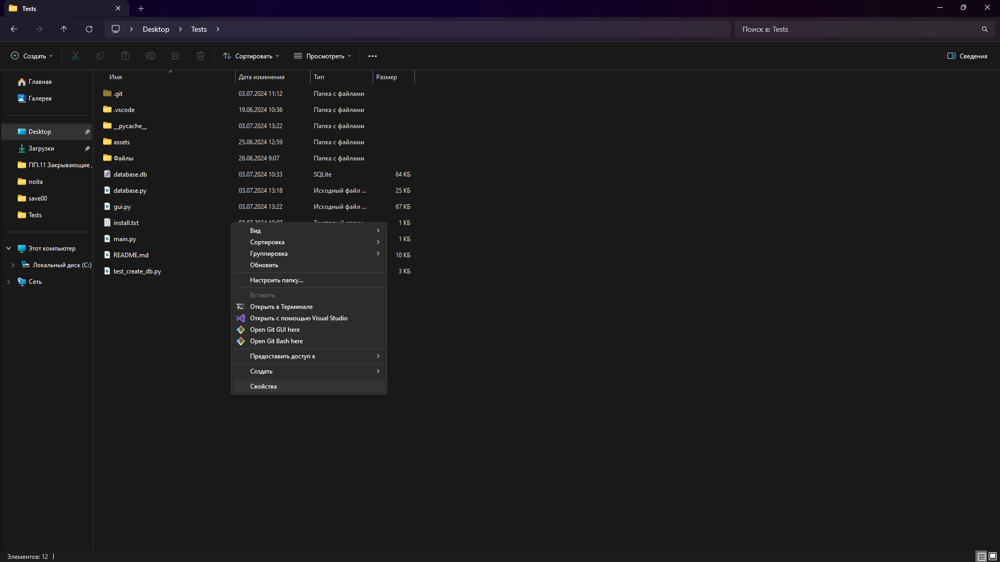

# Руководство администратора

Разрабатываемое приложение предназначено для администрирования баз данных, ведения справочников и проведения тестов.

## Системные требования

Для корректной работы программного продукта необходимо следующее аппаратное и программное обеспечение:

- Центральный процессор с тактовой частотой не менее 2.33 ГГц;
- Оперативная память объемом не менее 6 Гб;
- Дисковое пространство объемом не менее 3 Гб;
- Разрешение монитора не менее 1280x720 пикселей.

Программа поддерживает операционные системы Windows 7 и выше. Для функционирования информационной системы необходимо установить VS Code и Python версии 3.10.11 и выше. Информационная система разработана на языке программирования Python.

## Установка и модификация приложения

Для установки приложения необходимо выполнить следующие шаги:

1. Запустите установочный файл приложения.
2. Установите требуемые библиотеки, используемые в проекте. Для этого в папке проекта нажмите правой кнопкой мыши и в открывшемся контекстном меню выберите *"Открыть в терминале"* (рисунок 1).
3. Введите команду (рисунок 2):

```shell
pip install -r install.txt
```

4. Нажмите Enter

Для запуска приложения впоследствии необходимо выполнить файл с расширением .exe.

Для модификации и доработки приложения требуется установка программы VS Code или Visual Studio 2019 и выше. В выбранной среде разработки откройте и запустите интересующий файл с кодом.



Рисунок 1 - Установка библиотек


Рисунок 2 - Установка библиотек

## Функционал пользователей

### Режим ***"Администратор"***

Пользователь в режиме администратора имеет возможность:

- Добавлять, удалять, редактировать и импортировать данные пользователей из файлов;
- Управлять группами пользователей: добавлять, удалять и редактировать группы; изменять состав групп (включать и исключать из групп учащихся и преподавателей);
- Добавлять, удалять, редактировать и просматривать тесты.

### Режим ***"Куратор"***

В режиме куратора пользователь может:

- Создавать, удалять и редактировать группы;
- Назначать в группы учащихся и преподавателей, а также просматривать оценки за пройденные тесты;
- Формировать отчеты и экспортировать их в формате PDF или Excel.

### Режим ***"Преподаватель"***

Преподаватель в данном режиме имеет возможность:

- Создавать, удалять и редактировать тесты;
- Просматривать оценки за пройденные тесты, формировать отчеты и экспортировать их в формате PDF или Excel.

### Режим ***"Учащийся"***

Учащийся в данном режиме может:

- Проходить тесты;
- Просматривать свои оценки.

***Учащийся*** также может ознакомиться с результатами своих тестов с целью самопроверки и анализа ошибок. Возможности учащихся в данном режиме ограничены, что позволяет сосредоточиться исключительно на учебной деятельности и получении обратной связи по итогам тестирования.

# Руководство пользователя

Для запуска приложения следует выполнить файл **`main.exe`**. После этого откроется главное окно программы. Для управления доступом предусмотрено окно аутентификации (Рисунок 3).


*Рисунок 3 - Окно авторизации*

В окне необходимо ввести логин и пароль, затем нажать кнопку "Войти". После успешной аутентификации откроется главное окно приложения, соответствующее уровню доступа пользователя. Для администратора доступно специальное окно, предназначенное для работы с базой данных (Рисунок 4).


*Рисунок 4 - Главное окно администратора*

Для управления пользователями следует выбрать кнопку "Пользователи". Это откроет меню выбора пользователей (Рисунок 5). При выборе пользователя отображается окно с таблицей, функциями поиска и управления.


*Рисунок 5 - Окно для выбора пользователя*

Выбрав пользователя, откроется таблица с его данными и кнопками для работы с записями (Рисунок 6).


*Рисунок 6 - Таблица пользователей*

Чтобы добавить нового пользователя, нажмите "Добавить пользователя" (Рисунок 7); для редактирования пользователя выберите запись в таблице и нажмите "Редактировать пользователя" (Рисунок 8); для удаления записи выберите нужную строку и нажмите "Удалить выбранного пользователя" (Рисунки 9-10). Также возможен экспорт данных из CSV файла (Рисунок 11).


*Рисунок 7 - Добавление записи студента*


*Рисунок 8 - Редактирование записи студента*


*Рисунок 9 - Удаление записи студента*


*Рисунок 10 - Удаление записи студента*


*Рисунок 11 - Экспорт данных из CSV файла*

Для работы с группами выберите "Группы" (Рисунок 12).


*Рисунок 12 - Окно для работы с группами*

Для просмотра преподавателей, студентов группы и тестов группы выберите запись из таблицы группы (Рисунки 13-15).


*Рисунок 13 - Окно для работы с группами*


*Рисунок 14 - Окно для работы с группами*


*Рисунок 15 - Окно для работы с группами*

При нажатии на кнопку "Тесты" откроется таблица, в которой выводятся все тесты (Рисунок 16).


*Рисунок 16 - Таблица с тестами*

На этой форме можно добавить (Рисунок 17) или удалить тесты из справочника "Тесты".


*Рисунок 17 - Форма добавления теста*

Для того чтобы посмотреть людей, которые прошли тест необходимо дважды нажать на запись в таблице, после чего откроется таблица с учащимися и их результатами (Рисунок 18).


*Рисунок 18 - Учащиеся, которые прошли тест*

Также эту таблицу можно вывести в качестве отчета в Word и Excel (Рисунки 19-20). Для этого необходимо нажать на кнопку "Отчет в Word и Excel".


*Рисунок 19 - Вывод таблицы в Word*


*Рисунок 20 - Вывод таблицы в Excel*